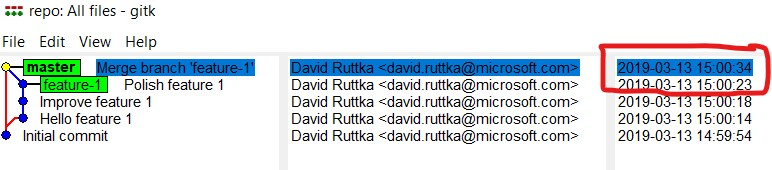
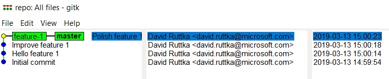
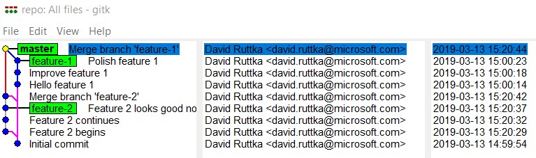
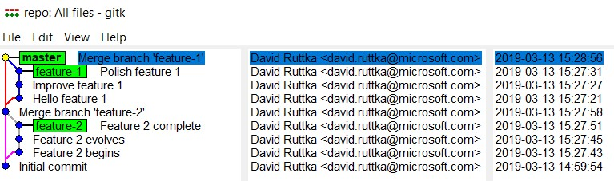

# Compromises: Atomicity on the graph

One of the common concerns raised when discussing [atomic commits](./commits.md#atomicity) is whether this overcomplicates, clutters, or pollutes the graph. That's a fair question, and there are certainly tradeoffs. Depending on the branching strategy, there are some potential compromises.

> NOTE: These compromises will touch on rebasing (all but one of them inherently include rebasing). A detailed discussion of rebasing, including when (and when **not**) to do it will be a separate discussion. If you're not familiar with rebasing yet, don't worry! The intended scope of this discussion is to show some alternatives for balancing atomicity of the commits against a desire to keep a clean graph. If you like one of these approaches, then you can dive into rebase to learn how to make it happen!

## The scenic pulloff

Here, we obtain a graph on which we have a linear path down the mainline branch, but merge commits allow us to see a more complete picture of the work performed on the incoming branch. I call this the "scenic pulloff" because the visualization of the graph reminds me of driving down coastal highways with an option to take a short arc closer to the water.

```bash
c:\code\repo>git log --graph --oneline --decorate
*   5fbacfd (HEAD -> master) Merge branch 'feature-1'
|\
| * c5497e2 (feature-1) Polish feature 1
| * d06214d Improve feature 1
| * 33f2d28 Hello feature 1
|/
* 5a2c3fc Initial commit
```

Notice that the merge node on `master` contains some detail about when `feature-1` was incorporated into `master`, but we still have all of the detail of what was done on that branch - including who did the work and when!



### A note on the merge node

While this does not change the level of atomicity, I feel that it's important to point out that for *the scenic bypass*, I force merge nodes rather than allowing a fast-forward.

When I executed the merge of `feature-1` into `master`, I used the `--no-ff` flag. Compare this to the graph which would result from merging the same changes, but allowing a fast-forward. In such a case, we would **not** capture any detail about when the changes were officially brought into the mainline, because we have only advanced the `master` ref to point at the same commit as  `feature-1` without augmenting our graph with a detailed merge node.

```bash
c:\code\repo>git log --graph --decorate --oneline
* c5497e2 (HEAD -> master, feature-1) Polish feature 1
* d06214d Improve feature 1
* 33f2d28 Hello feature 1
* 5a2c3fc Initial commit
```



### A note on the location of the pulloffs

This is also an aside which does not impact the atomicity of commits, but I feel it is worth mentioning. If multiple branches are in flight, they could create a graph which appears to cross over itself or create "tracks". For example:



> NOTE: This is a great opportunity to compare the lineage of the commit nodes on the graph to their chronological timestamps. When I was learning git, this helped drive home the point that git is a graph, and the nodes on the graph contain information far beyond their position in the lineage.

This is one of the primary reasons I encourage rebasing the feature branch before merging it. Now all the scenic pulloffs are "bubbles on the top".

> NOTE: Here, I did not perform an interactive rebase to squash, combine, fixup, or otherwise alter the commits. Just a default rebase to move the commit nodes up the graph.



## The squash

This one is all about separating "the story of the project" from "the story of this work," whether that work is a feature, bug fix, or whatever. The thought process goes:

- Perform work on a topic branch, committing frequently and atomically
- This will generate a great deal of "WIP" commits, broken commits, fixup commits, temporary commits...
- When merging the work, flatten it all to a single commit node, because the detail is no longer relevant

This can be a great balance. While work is in progress, the frequent and atomic checkpoints are there. Teammates, as they review the code, can gain insight into the evolution of the feature and the thought processes that went into it. If something goes wrong, there's still a good chance that bisect or revert can help set it right. However in the long term vision of the project, people just care that, on the whole, the feature was implemented or the bug was fixed.

One thing to watch out for here is whether there are any audit or compliance constraints which require preservation of the full commit history.

## The Marty McFly

This one is all about using an interactive rebase to time travel and alter (hopefully fix) your history. The thought process goes:

- Perform work on a topic branch, committing frequently and atomically
- This will generate a great deal of "WIP" commits, broken commits, fixup commits, temporary commits...
- Before merging, perform an interactive rebase to combine those commits into a smaller set to represent the "key stages" of the work

The most significant downside here is that commits *could* get combined in ways that are not logical, don't build, don't pass tests, etc. Teams will also need to consider whether this approach will violate any compliance or audit requirements.
