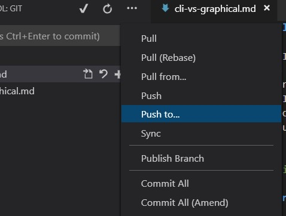
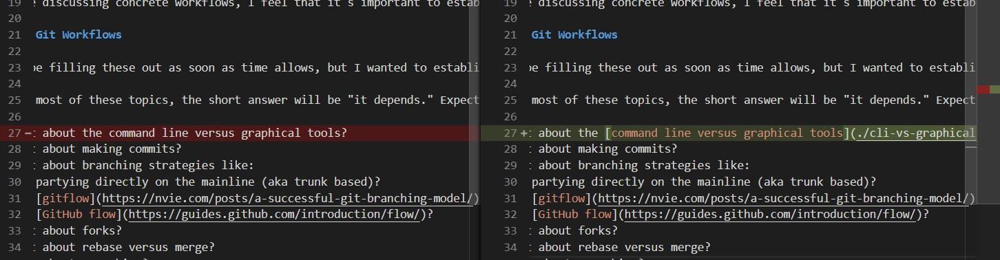
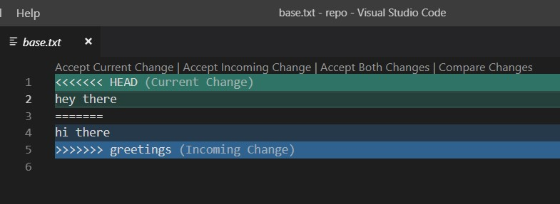

# The command line versus graphical tools

Historically, I had a very strong opinion that everything should be done at the command line, with some exceptions like configuring a `difftool` and a `mergetool`, or for using `gitk`. I'm not sure if it's because I've grown, or because the tools have grown, or (most likely) a little bit of both, but my current position here is: **it depends, and sometimes it does not even matter**.

A few examples...

<!-- markdownlint-disable MD026 -->

## Staging changes, fetching, pushing, etc.

Here, I still **personally** prefer the command line. Much of this comes from habit, but there's also much to be said for the flexibility, control, and power. Dropping back to the command line to stage changes, commit, fetch, reset, push, etc. eliminates an opaque level of abstraction that sits between me and git - a process which might interact with git in a way which does not align to my expectations.

To wit, I use [VS Code](https://code.visualstudio.com/) quite a bit these days, and the git tooling truly has come extremely far compared to what I remember from earlier Visual Studio releases. However, which of these, if any, will *only* fetch? And what exactly is included in a "Sync"?



That said, if your project and team are using a "happy path" workflow and the graphical tools aren't causing problems, I can absolutely understand how they can keep people focused on their work instead of remembering git syntax.

## Diffing and merging

Here, I **personally** prefer graphical tools. Back in 2015, I presented a lunch and learn to my team all about diffing and merging. We took a deep dive into the formatting of diff output, resolved some merges in a text editor, and then I strongly recommended using tools like [Meld](http://meldmerge.org/) and [kdiff3](http://kdiff3.sourceforge.net/) instead. Today, I would still recommend using external graphical tools, but I'd coalesce around using VS Code.

Here's what a diff might look like executing `git diff`. Notice the `-` and the `+` indicating what lines were removed and added.

```bash
diff --git a/README.md b/README.md
index d1f2039..be15f22 100644
--- a/README.md
+++ b/README.md
@@ -24,7 +24,7 @@ I'll be filling these out as soon as time allows, but I wanted to establish a ro

 > For most of these topics, the short answer will be "it depends." Expect a **discussion of whens, whys, and tradeoffs.**

-- What about the command line versus graphical tools?
+- What about the [command line versus graphical tools](./cli-vs-graphical.md)?
 - What about making commits?
 - What about branching strategies like:
     - partying directly on the mainline (aka trunk based)?
```

And here's what it would look like in VS Code's UI. Notice not only the side by side comparison, but the highlights on the portion of the line that changed!



For merges, it's even more intense. Here's what a conflict would look like if two people changed a line of text, one to say "hey there" and the other to say "hi there".

```bash
- hey there
 -hi there
++<<<<<<< HEAD
++hey there
++=======
++hi there
++>>>>>>> greetings
```

Or with [the diff3 option](https://stackoverflow.com/questions/27417656/should-diff3-be-default-conflictstyle-on-git) you can also see what the common ancestor looked like

```bash
--- a/base.txt
+++ b/base.txt
@@@ -1,1 -1,1 +1,6 @@@
- hey there
 -hi there
++<<<<<<< HEAD
++hey there
++||||||| merged common ancestors
++=======
++hi there
++>>>>>>> greetings
```

Now, we can edit the file to remove the markers and keep the desired final result, but as files get larger and conflicts get more complex, it becomes much more managable in a graphical tool. Not only is it more readable, but there's less chance of human error when editing the markers.

VS Code lets you toggle between a view that shows the markers, as above, with actionable UI to choose which change(s) to accept...



...or comparing the changes side by side to get a better feel for who did what.


## Visualizing the graph

When available, `gitk`. When not, `git log --graph --decorate --oneline`.